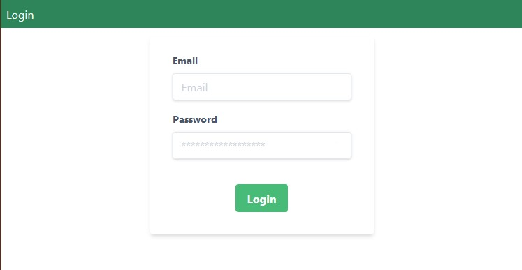
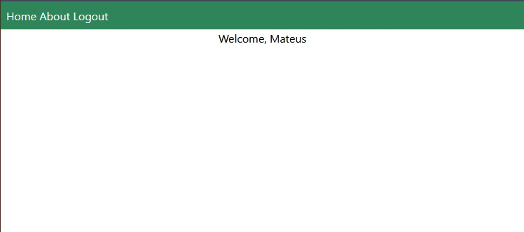

# Webapp Frontend Example


This is nothing but an extra-simple frontend done with [Vue.js](https://vuejs.org/). It is used for testing the '/login/' endpoint from my [deno.js test project](https://github.com/mtrissi/denojs-rest-api).

## Project setup
```
npm install
```

### Compiles and hot-reloads for development
```
npm run serve
```

### Compiles and minifies for production
```
npm run build
```

### Lints and fixes files
```
npm run lint
```

# Screenshots
Login Page:



After logging in:


